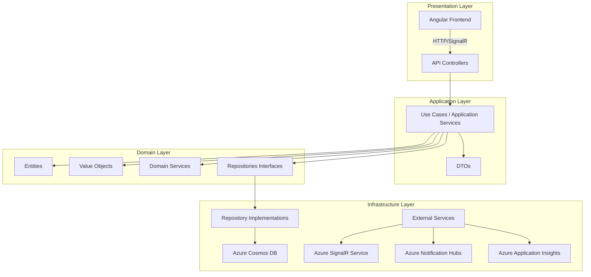

# Task management architecture

1. Create a Task
   - Use Case: As a user, I want to create a new task with a title, description, due date, and priority.
   - TDD Approach:
     1. Write a test for the CreateTask use case in the application layer.
     2. Implement the use case to pass the test.
     3. Refactor if necessary.
   - DDD Concepts:
     - Define a Task entity with properties like Id, Title, Description, DueDate, Priority, and Status.
     - Create a TaskCreated domain event.

2. Assign a Task
   - Use Case: As a user, I want to assign a task to another user.
   - TDD Approach:
     1. Write a test for the AssignTask use case.
     2. Implement the use case to pass the test.
     3. Refactor if necessary.
   - DDD Concepts:
     - Add an Assignee property to the Task entity.
     - Create a TaskAssigned domain event.

3. Update Task Status
   - Use Case: As a user, I want to update the status of a task (e.g., To Do, In Progress, Done).
   - TDD Approach:
     1. Write a test for the UpdateTaskStatus use case.
     2. Implement the use case to pass the test.
     3. Refactor if necessary.
   - DDD Concepts:
     - Define a TaskStatus value object.
     - Create a TaskStatusUpdated domain event.

4. List Tasks
   - Use Case: As a user, I want to view a list of tasks with filtering and sorting options.
   - TDD Approach:
     1. Write a test for the ListTasks use case with various filter and sort parameters.
     2. Implement the use case to pass the test.
     3. Refactor if necessary.
   - DDD Concepts:
     - Implement a specification pattern for flexible querying.

5. Receive Real-time Updates
   - Use Case: As a user, I want to receive real-time updates when tasks are created, assigned, or status changed.
   - TDD Approach:
     1. Write tests for the real-time notification service.
     2. Implement the service to pass the tests.
     3. Refactor if necessary.
   - DDD Concepts:
     - Implement domain events for task changes.
     - Create an event dispatcher in the application layer.

Here's how we can structure our solution following Clean Architecture principles:

1. Domain Layer:
   - Entities: Task, User
   - Value Objects: TaskStatus, Priority
   - Domain Services: TaskAssignmentService
   - Repository Interfaces: ITaskRepository, IUserRepository

2. Application Layer:
   - Use Cases: CreateTaskUseCase, AssignTaskUseCase, UpdateTaskStatusUseCase, ListTasksUseCase
   - DTOs: TaskDTO, UserDTO
   - Interfaces for external services: INotificationService

3. Infrastructure Layer:
   - Repository Implementations: CosmosDbTaskRepository, CosmosDbUserRepository
   - External Services: AzureSignalRNotificationService, AzureNotificationHubService

4. Presentation Layer:
   - API Controllers: TaskController, UserController
   - Angular Components: TaskListComponent, TaskDetailComponent, etc.

To implement TDD:

1. Start by writing tests for each use case in the application layer.
2. Implement the use cases to pass the tests.
3. Write integration tests for the API controllers.
4. Implement the controllers to pass the tests.
5. For the frontend, write unit tests for Angular components and services.
